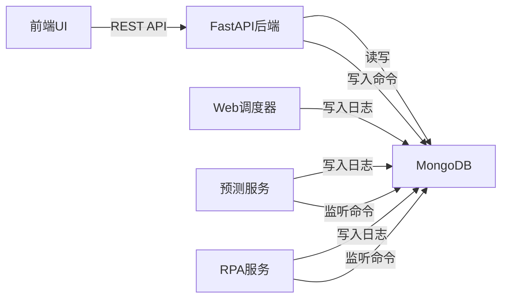

# 任务日志告警页面 - 实施计划

## 概述

在"系统管理"菜单下新增"任务日志告警"页面,实现对Web后端、预测服务(STEF)和RPA服务的统一任务监控、告警管理和远程任务触发功能。

### 核心目标

1. **统一监控**: 在一个页面查看三个子系统的任务执行状态
2. **告警管理**: 查看、确认、解决系统告警
3. **远程触发**: 手动触发预测任务或数据下载任务
4. **Web调度器**: 为Web子系统添加轻量级定时任务调度能力

### 技术架构



---

## 后端开发

### 1. 数据模型 (`webapp/models/task_monitor.py`)

#### 1.1 枚举类定义

```python
from enum import Enum

class ServiceType(str, Enum):
    """服务类型"""
    WEB = "web"
    FORECAST = "forecast"
    RPA = "rpa"
    SYSTEM = "system"

class TaskType(str, Enum):
    """任务类型"""
    # Web 任务
    CACHE_REFRESH = "cache_refresh"
    DATA_ARCHIVE = "data_archive"
    REPORT_GEN = "report_gen"
    METER_DATA_IMPORT = "meter_data_import"  # 计量点数据导入
    LOAD_AGGREGATION = "load_aggregation"    # 负荷数据聚合
    CHARACTERISTIC_ANALYSIS = "characteristic_analysis"  # 负荷特征分析
    
    # 预测任务
    D1_PRICE_PRED = "d1_price_pred"  # D-1日前价格预测
    D2_PRICE_PRED = "d2_price_pred"  # D-2日前价格预测
    LOAD_PRED = "load_pred"          # 负荷预测
    
    # 模型训练任务
    D1_PRICE_TRAIN = "d1_price_train"  # D-1价格模型训练
    D2_PRICE_TRAIN = "d2_price_train"  # D-2价格模型训练
    LOAD_TRAIN = "load_train"          # 负荷模型训练
    
    # RPA 任务
    RPA_LOGIN = "rpa_login"
    RPA_DATA_BATCH_DOWNLOAD = "rpa_data_batch_download"
    RPA_SINGLE_ITEM_DOWNLOAD = "rpa_single_item_download"

class TaskStatus(str, Enum):
    """任务状态"""
    RUNNING = "RUNNING"
    SUCCESS = "SUCCESS"
    FAILED = "FAILED"
    WAITING = "WAITING"
    PARTIAL = "PARTIAL"

class TriggerType(str, Enum):
    """触发方式"""
    SCHEDULE = "schedule"  # 定时调度
    MANUAL = "manual"      # 手动触发
    EVENT = "event"        # 事件触发

class AlertLevel(str, Enum):
    """告警级别"""
    P0 = "P0"  # 紧急阻断
    P1 = "P1"  # 重要失败
    P2 = "P2"  # 一般警告

class AlertCategory(str, Enum):
    """告警类别"""
    TASK_FAILED = "TASK_FAILED"
    TASK_TIMEOUT = "TASK_TIMEOUT"
    DATA_MISSING = "DATA_MISSING"
    LOGIN_FAILED = "LOGIN_FAILED"
    VALIDATION_ERR = "VALIDATION_ERR"
    SYSTEM_ERR = "SYSTEM_ERR"

class AlertStatus(str, Enum):
    """告警状态"""
    ACTIVE = "ACTIVE"
    ACKNOWLEDGED = "ACKNOWLEDGED"
    RESOLVED = "RESOLVED"
    IGNORED = "IGNORED"

class CommandStatus(str, Enum):
    """命令状态"""
    PENDING = "PENDING"
    RECEIVED = "RECEIVED"
    COMPLETED = "COMPLETED"
    FAILED = "FAILED"
```

#### 1.2 Pydantic 模型

```python
from pydantic import BaseModel, Field
from typing import Optional, Dict, Any
from datetime import datetime

class TaskExecutionLog(BaseModel):
    """任务执行日志"""
    task_id: str = Field(..., description="全局唯一ID")
    service_type: ServiceType
    task_type: str
    task_name: str
    status: TaskStatus
    start_time: datetime
    end_time: Optional[datetime] = None
    duration: Optional[float] = None
    summary: Optional[str] = None
    details: Optional[Dict[str, Any]] = None
    error: Optional[Dict[str, Any]] = None
    trigger_type: TriggerType

class SystemAlert(BaseModel):
    """系统告警"""
    alert_id: str
    level: AlertLevel
    category: AlertCategory
    title: str
    content: str
    service_type: ServiceType
    task_type: Optional[str] = None
    related_task_id: Optional[str] = None
    status: AlertStatus
    created_at: datetime
    resolved_at: Optional[datetime] = None
    resolved_by: Optional[str] = None
    resolution_note: Optional[str] = None
    context: Optional[Dict[str, Any]] = None

class TaskCommand(BaseModel):
    """任务命令"""
    command_id: str
    target_service: ServiceType
    command_type: str  # TRIGGER_TASK, RELOAD_CONFIG, CANCEL_TASK
    payload: Dict[str, Any]
    status: CommandStatus
    created_at: datetime
    created_by: str
    executed_at: Optional[datetime] = None
    result: Optional[Dict[str, Any]] = None
```

---

### 2. 服务层 (`webapp/services/task_monitor_service.py`)

#### 2.1 核心服务类

```python
from webapp.tools.mongo import DATABASE
from webapp.models.task_monitor import *
from typing import List, Optional
from datetime import datetime, date

class TaskMonitorService:
    """任务监控服务"""
    
    def __init__(self):
        self.db = DATABASE
        self.logs_collection = self.db["task_execution_logs"]
        self.alerts_collection = self.db["system_alerts"]
        self.commands_collection = self.db["task_commands"]
    
    # ========== 任务日志相关 ==========
    
    async def get_task_summary(self, target_date: date) -> Dict[str, Any]:
        """获取指定日期的任务统计摘要"""
        # 统计三个服务的任务成功率和告警数
        pass
    
    async def get_task_logs(
        self,
        page: int = 1,
        page_size: int = 20,
        service_type: Optional[str] = None,
        task_type: Optional[str] = None,
        status: Optional[str] = None,
        start_date: Optional[date] = None,
        end_date: Optional[date] = None
    ) -> Dict[str, Any]:
        """获取任务日志列表(分页)"""
        pass
    
    async def get_task_detail(self, task_id: str) -> Optional[Dict[str, Any]]:
        """获取任务详情"""
        pass
    
    # ========== 告警相关 ==========
    
    async def get_alerts(
        self,
        page: int = 1,
        page_size: int = 100,  # 告警数据量少,一页显示
        status: Optional[str] = None,
        level: Optional[str] = None,
        category: Optional[str] = None,
        service_type: Optional[str] = None
    ) -> Dict[str, Any]:
        """获取告警列表"""
        pass
    
    async def get_alert_detail(self, alert_id: str) -> Optional[Dict[str, Any]]:
        """获取告警详情"""
        pass
    
    async def acknowledge_alert(self, alert_id: str, user: str) -> bool:
        """确认告警"""
        pass
    
    async def resolve_alert(
        self, 
        alert_id: str, 
        user: str, 
        note: str
    ) -> bool:
        """解决告警"""
        pass
    
    async def ignore_alert(
        self, 
        alert_id: str, 
        user: str, 
        reason: str
    ) -> bool:
        """忽略告警"""
        pass
    
    # ========== 命令相关 ==========
    
    async def get_commands(
        self,
        page: int = 1,
        page_size: int = 100,
        status: Optional[str] = None,
        target_service: Optional[str] = None
    ) -> Dict[str, Any]:
        """获取命令列表"""
        pass
    
    async def create_command(
        self,
        target_service: str,
        task_type: str,
        parameters: Dict[str, Any],
        user: str
    ) -> str:
        """创建远程命令"""
        # 生成 command_id: cmd_{timestamp}_{uuid}
        # 写入 task_commands 集合
        pass
```

---

### 3. API 路由 (`webapp/api/v1_task_monitor.py`)

#### 3.1 路由定义

```python
from fastapi import APIRouter, Depends, HTTPException, Query
from webapp.services.task_monitor_service import TaskMonitorService
from webapp.api.v1 import get_current_active_user
from typing import Optional
from datetime import date

router = APIRouter(prefix="/tasks", tags=["任务监控"])

# ========== 任务监控 ==========

@router.get("/summary")
async def get_task_summary(
    target_date: date = Query(..., description="目标日期"),
    current_user = Depends(get_current_active_user)
):
    """获取任务统计摘要"""
    service = TaskMonitorService()
    return await service.get_task_summary(target_date)

@router.get("/execution-logs")
async def get_execution_logs(
    page: int = Query(1, ge=1),
    page_size: int = Query(20, ge=1, le=100),
    service_type: Optional[str] = None,
    task_type: Optional[str] = None,
    status: Optional[str] = None,
    start_date: Optional[date] = None,
    end_date: Optional[date] = None,
    current_user = Depends(get_current_active_user)
):
    """获取任务执行日志列表"""
    service = TaskMonitorService()
    return await service.get_task_logs(
        page, page_size, service_type, task_type, status, start_date, end_date
    )

@router.get("/execution-logs/{task_id}")
async def get_task_detail(
    task_id: str,
    current_user = Depends(get_current_active_user)
):
    """获取任务详情"""
    service = TaskMonitorService()
    result = await service.get_task_detail(task_id)
    if not result:
        raise HTTPException(status_code=404, detail="任务不存在")
    return result

# ========== 告警管理 ==========

@router.get("/alerts")
async def get_alerts(
    page: int = Query(1, ge=1),
    page_size: int = Query(100, ge=1, le=200),
    status: Optional[str] = None,
    level: Optional[str] = None,
    category: Optional[str] = None,
    service_type: Optional[str] = None,
    current_user = Depends(get_current_active_user)
):
    """获取告警列表"""
    service = TaskMonitorService()
    return await service.get_alerts(
        page, page_size, status, level, category, service_type
    )

@router.post("/alerts/{alert_id}/acknowledge")
async def acknowledge_alert(
    alert_id: str,
    current_user = Depends(get_current_active_user)
):
    """确认告警"""
    service = TaskMonitorService()
    success = await service.acknowledge_alert(alert_id, current_user.username)
    if not success:
        raise HTTPException(status_code=404, detail="告警不存在")
    return {"success": True, "message": "告警已确认"}

@router.post("/alerts/{alert_id}/resolve")
async def resolve_alert(
    alert_id: str,
    note: str,
    current_user = Depends(get_current_active_user)
):
    """解决告警"""
    service = TaskMonitorService()
    success = await service.resolve_alert(alert_id, current_user.username, note)
    if not success:
        raise HTTPException(status_code=404, detail="告警不存在")
    return {"success": True, "message": "告警已解决"}

@router.post("/alerts/{alert_id}/ignore")
async def ignore_alert(
    alert_id: str,
    reason: str,
    current_user = Depends(get_current_active_user)
):
    """忽略告警"""
    service = TaskMonitorService()
    success = await service.ignore_alert(alert_id, current_user.username, reason)
    if not success:
        raise HTTPException(status_code=404, detail="告警不存在")
    return {"success": True, "message": "告警已忽略"}

# ========== 远程触发 ==========

@router.get("/commands")
async def get_commands(
    page: int = Query(1, ge=1),
    page_size: int = Query(100, ge=1, le=200),
    status: Optional[str] = None,
    target_service: Optional[str] = None,
    current_user = Depends(get_current_active_user)
):
    """获取命令列表"""
    service = TaskMonitorService()
    return await service.get_commands(page, page_size, status, target_service)

@router.post("/trigger")
async def trigger_task(
    target_service: str,
    task_type: str,
    parameters: dict,
    current_user = Depends(get_current_active_user)
):
    """触发远程任务"""
    service = TaskMonitorService()
    command_id = await service.create_command(
        target_service, task_type, parameters, current_user.username
    )
    return {
        "success": True,
        "command_id": command_id,
        "message": "任务已加入队列,预计2分钟内开始执行"
    }
```

#### 3.2 注册路由

在 `webapp/main.py` 中:

```python
from webapp.api import v1_task_monitor

app.include_router(v1_task_monitor.router, prefix="/api/v1")
```

---

### 4. Web 调度器 (APScheduler)

#### 4.1 目录结构

```
webapp/
├── scheduler/
│   ├── __init__.py
│   ├── core.py              # 调度器核心
│   ├── logger.py            # 日志记录器
│   └── jobs/
│       ├── __init__.py
│       └── system_jobs.py   # 系统任务
```

#### 4.2 核心实现

**`webapp/scheduler/core.py`**

```python
from apscheduler.schedulers.asyncio import AsyncIOScheduler
from webapp.scheduler.jobs.system_jobs import clean_expired_logs, clean_expired_commands

scheduler = AsyncIOScheduler()

def setup_scheduler(app):
    """设置调度器"""
    
    # TODO: 在此注册Web端定时任务
    # 示例:
    # scheduler.add_job(
    #     meter_data_import_job,
    #     'cron',
    #     hour=1,
    #     minute=0,
    #     id='web_meter_data_import',
    #     replace_existing=True
    # )
    
    @app.on_event("startup")
    async def start_scheduler():
        scheduler.start()
        print("✅ APScheduler 已启动")
    
    @app.on_event("shutdown")
    async def stop_scheduler():
        scheduler.shutdown()
        print("🛑 APScheduler 已停止")
```

**`webapp/scheduler/logger.py`**

```python
from webapp.tools.mongo import DATABASE
from datetime import datetime
import uuid

class TaskLogger:
    """任务日志记录器"""
    
    @staticmethod
    async def log_task_start(service_type: str, task_type: str, task_name: str):
        """记录任务开始"""
        task_id = f"{service_type}_{task_type}_{datetime.now().strftime('%Y%m%d_%H%M%S')}_{uuid.uuid4().hex[:4]}"
        
        await DATABASE["task_execution_logs"].insert_one({
            "task_id": task_id,
            "service_type": service_type,
            "task_type": task_type,
            "task_name": task_name,
            "status": "RUNNING",
            "start_time": datetime.utcnow(),
            "trigger_type": "schedule"
        })
        
        return task_id
    
    @staticmethod
    async def log_task_end(task_id: str, status: str, summary: str = None, details: dict = None, error: dict = None):
        """记录任务结束"""
        end_time = datetime.utcnow()
        
        # 获取开始时间计算耗时
        log = await DATABASE["task_execution_logs"].find_one({"task_id": task_id})
        duration = (end_time - log["start_time"]).total_seconds() if log else None
        
        await DATABASE["task_execution_logs"].update_one(
            {"task_id": task_id},
            {"$set": {
                "status": status,
                "end_time": end_time,
                "duration": duration,
                "summary": summary,
                "details": details,
                "error": error
            }}
        )
```

**`webapp/scheduler/jobs/system_jobs.py`**

```python
from webapp.tools.mongo import DATABASE
from datetime import datetime, timedelta

# TODO: 在此添加Web端定时任务
# 示例:
# async def meter_data_import_job():
#     """计量点数据自动导入任务"""
#     pass
#
# async def load_aggregation_job():
#     """负荷数据聚合任务"""
#     pass
#
# async def characteristic_analysis_job():
#     """负荷特征分析任务"""
#     pass
```

**手动清理API** (在 `v1_task_monitor.py` 中添加):

```python
@router.post("/maintenance/clean-logs")
async def clean_logs(
    days: int = Query(30, description="清理多少天前的日志"),
    current_user = Depends(get_current_active_user)
):
    """手动清理过期任务日志"""
    cutoff_date = datetime.utcnow() - timedelta(days=days)
    result = await DATABASE["task_execution_logs"].delete_many({
        "start_time": {"$lt": cutoff_date}
    })
    return {
        "success": True,
        "deleted_count": result.deleted_count,
        "message": f"已清理 {result.deleted_count} 条过期日志"
    }

@router.post("/maintenance/clean-commands")
async def clean_commands(
    days: int = Query(7, description="清理多少天前的命令"),
    current_user = Depends(get_current_active_user)
):
    """手动清理过期命令"""
    cutoff_date = datetime.utcnow() - timedelta(days=days)
    result = await DATABASE["task_commands"].delete_many({
        "created_at": {"$lt": cutoff_date},
        "status": {"$in": ["COMPLETED", "FAILED"]}
    })
    return {
        "success": True,
        "deleted_count": result.deleted_count,
        "message": f"已清理 {result.deleted_count} 条过期命令"
    }
```

#### 4.3 集成到主应用

在 `webapp/main.py` 中:

```python
from webapp.scheduler.core import setup_scheduler

# 在创建 app 后添加
setup_scheduler(app)
```

---

## 前端开发

### 1. API 客户端 (`frontend/src/api/taskMonitor.ts`)

```typescript
import apiClient from './client';

export interface TaskSummary {
  web: { success: number; total: number; alerts: number };
  forecast: { success: number; total: number; alerts: number };
  rpa: { success: number; total: number; alerts: number };
}

export interface TaskLog {
  task_id: string;
  service_type: string;
  task_type: string;
  task_name: string;
  status: string;
  start_time: string;
  end_time?: string;
  duration?: number;
  summary?: string;
}

export interface Alert {
  alert_id: string;
  level: string;
  category: string;
  title: string;
  content: string;
  service_type: string;
  status: string;
  created_at: string;
  related_task_id?: string;
}

export interface TaskCommand {
  command_id: string;
  target_service: string;
  command_type: string;
  status: string;
  created_at: string;
  created_by: string;
}

// 任务监控
export const getTaskSummary = (targetDate: string) =>
  apiClient.get<TaskSummary>(`/api/v1/tasks/summary?target_date=${targetDate}`);

export const getTaskLogs = (params: any) =>
  apiClient.get('/api/v1/tasks/execution-logs', { params });

export const getTaskDetail = (taskId: string) =>
  apiClient.get(`/api/v1/tasks/execution-logs/${taskId}`);

// 告警管理
export const getAlerts = (params: any) =>
  apiClient.get('/api/v1/tasks/alerts', { params });

export const acknowledgeAlert = (alertId: string) =>
  apiClient.post(`/api/v1/tasks/alerts/${alertId}/acknowledge`);

export const resolveAlert = (alertId: string, note: string) =>
  apiClient.post(`/api/v1/tasks/alerts/${alertId}/resolve`, { note });

export const ignoreAlert = (alertId: string, reason: string) =>
  apiClient.post(`/api/v1/tasks/alerts/${alertId}/ignore`, { reason });

// 远程触发
export const getCommands = (params: any) =>
  apiClient.get('/api/v1/tasks/commands', { params });

export const triggerTask = (data: {
  target_service: string;
  task_type: string;
  parameters: any;
}) => apiClient.post('/api/v1/tasks/trigger', data);
```

---

### 2. 页面组件结构

#### 2.1 主页面 (`frontend/src/pages/TaskLogAlertPage.tsx`)

```
TaskLogAlertPage
├─ 移动端面包屑标题 "系统管理 / 任务日志告警"
├─ Tab 导航 (任务监控 / 告警中心 / 远程触发)
├─ 手动刷新按钮 (右上角)
└─ TabPanel 容器
    ├─ TaskMonitorTab (index=0)
    ├─ AlertCenterTab (index=1)
    └─ RemoteTriggerTab (index=2)
```

#### 2.2 Tab 1: 任务监控 (`TaskMonitorTab.tsx`)

**布局**:
```
┌─────────────────────────────────────────┐
│ [日期选择器] [刷新按钮]                  │
├─────────────────────────────────────────┤
│ [Web健康卡片] [Forecast健康卡片] [RPA健康卡片] │
├─────────────────────────────────────────┤
│ [筛选器: 服务类型 / 任务类型 / 状态]     │
├─────────────────────────────────────────┤
│ [任务日志表格/卡片列表]                  │
│ - 服务 | 任务名称 | 状态 | 时间 | 耗时  │
│ - [详情] 按钮                            │
└─────────────────────────────────────────┘
```

**组件**:
- `ServiceHealthCard.tsx` - 服务健康卡片
- `TaskLogTable.tsx` - 任务日志表格(桌面端)
- `TaskLogMobileCard.tsx` - 任务日志卡片(移动端)
- `TaskDetailDialog.tsx` - 任务详情对话框

#### 2.3 Tab 2: 告警中心 (`AlertCenterTab.tsx`)

**布局**:
```
┌─────────────────────────────────────────┐
│ [活跃告警卡片] [P0告警卡片] [P1告警卡片] │
├─────────────────────────────────────────┤
│ [筛选器: 状态 / 级别 / 类别]             │
├─────────────────────────────────────────┤
│ [告警表格/卡片列表]                      │
│ - 级别 | 类别 | 标题 | 时间 | 状态      │
│ - [确认] [解决] [忽略] 按钮              │
└─────────────────────────────────────────┘
```

**组件**:
- `AlertStatsCard.tsx` - 告警统计卡片
- `AlertTable.tsx` - 告警表格(桌面端)
- `AlertMobileCard.tsx` - 告警卡片(移动端)
- `AlertDetailDialog.tsx` - 告警详情对话框
- `AlertActionDialog.tsx` - 告警操作对话框

#### 2.4 Tab 3: 远程触发 (`RemoteTriggerTab.tsx`)

**布局**:
```
┌─────────────────────────────────────────┐
│ [任务选择表单]                           │
│ - 目标服务: [下拉选择]                   │
│ - 任务类型: [下拉选择]                   │
│ - 参数配置: [动态表单]                   │
│ - [立即执行] 按钮                        │
├─────────────────────────────────────────┤
│ [命令历史表格]                           │
│ - 命令ID | 任务 | 状态 | 创建时间        │
└─────────────────────────────────────────┘
```

**组件**:
- `TaskTriggerForm.tsx` - 任务触发表单
- `CommandHistoryTable.tsx` - 命令历史表格
- `TriggerConfirmDialog.tsx` - 触发确认对话框

---

### 3. 路由配置

#### 3.1 添加路由 (`frontend/src/App.tsx`)

```typescript
import TaskLogAlertPage from './pages/TaskLogAlertPage';

// 在路由配置中添加
<Route
  path="/system/task-monitor"
  element={
    <ProtectedRoute>
      <TaskLogAlertPage />
    </ProtectedRoute>
  }
/>
```

#### 3.2 添加菜单 (`frontend/src/components/Sidebar.tsx`)

```typescript
{
  title: '系统管理',
  icon: <SettingsIcon />,
  children: [
    {
      title: '数据下载监控',
      path: '/rpa-monitor',
      icon: <CloudDownloadIcon />
    },
    {
      title: '任务日志告警',  // 新增
      path: '/system/task-monitor',
      icon: <AssignmentIcon />
    }
  ]
}
```

---

## 验证方案

### 1. 后端验证

#### 1.1 MongoDB 数据准备

创建测试脚本 `scripts/create_test_task_data.py`:

```python
"""创建测试任务数据"""
from webapp.tools.mongo import DATABASE
from datetime import datetime, timedelta
import random

async def create_test_data():
    # 清空现有数据
    await DATABASE["task_execution_logs"].delete_many({})
    await DATABASE["system_alerts"].delete_many({})
    await DATABASE["task_commands"].delete_many({})
    
    # 创建任务日志
    services = ["web", "forecast", "rpa"]
    statuses = ["SUCCESS", "SUCCESS", "SUCCESS", "FAILED"]  # 75%成功率
    
    for i in range(50):
        service = random.choice(services)
        status = random.choice(statuses)
        start_time = datetime.utcnow() - timedelta(hours=random.randint(0, 24))
        
        await DATABASE["task_execution_logs"].insert_one({
            "task_id": f"{service}_test_{i}",
            "service_type": service,
            "task_type": "test_task",
            "task_name": f"测试任务 {i}",
            "status": status,
            "start_time": start_time,
            "end_time": start_time + timedelta(seconds=random.randint(5, 300)),
            "duration": random.randint(5, 300),
            "trigger_type": "schedule"
        })
    
    # 创建告警
    for i in range(10):
        await DATABASE["system_alerts"].insert_one({
            "alert_id": f"alert_test_{i}",
            "level": random.choice(["P0", "P1", "P2"]),
            "category": "TASK_FAILED",
            "title": f"测试告警 {i}",
            "content": "这是一个测试告警",
            "service_type": random.choice(services),
            "status": random.choice(["ACTIVE", "RESOLVED"]),
            "created_at": datetime.utcnow() - timedelta(hours=random.randint(0, 24))
        })
    
    print("✅ 测试数据创建完成")

if __name__ == "__main__":
    import asyncio
    asyncio.run(create_test_data())
```

**运行命令**:
```bash
python scripts/create_test_task_data.py
```

#### 1.2 API 测试

启动后端服务后,访问 Swagger UI 测试所有接口:

```bash
uvicorn webapp.main:app --reload --host 0.0.0.0 --port 8005
```

访问 `http://127.0.0.1:8005/docs`,测试以下接口:
- [ ] `GET /api/v1/tasks/summary`
- [ ] `GET /api/v1/tasks/execution-logs`
- [ ] `GET /api/v1/tasks/execution-logs/{task_id}`
- [ ] `GET /api/v1/tasks/alerts`
- [ ] `POST /api/v1/tasks/alerts/{alert_id}/acknowledge`
- [ ] `POST /api/v1/tasks/alerts/{alert_id}/resolve`
- [ ] `POST /api/v1/tasks/alerts/{alert_id}/ignore`
- [ ] `GET /api/v1/tasks/commands`
- [ ] `POST /api/v1/tasks/trigger`

---

### 2. 前端验证

#### 2.1 编译检查

```bash
npm run build --prefix frontend
```

确保无 TypeScript 编译错误。

#### 2.2 功能测试清单

**任务监控 Tab**:
- [ ] 日期选择器正常工作
- [ ] 三个服务健康卡片正确显示统计数据
- [ ] 任务日志表格正确加载数据
- [ ] 筛选器功能正常
- [ ] 点击"详情"按钮显示任务详情对话框
- [ ] 移动端使用卡片布局

**告警中心 Tab**:
- [ ] 统计卡片正确显示活跃告警数
- [ ] 告警列表正确加载数据
- [ ] 筛选器功能正常
- [ ] "确认"按钮正常工作
- [ ] "解决"按钮弹出对话框并提交
- [ ] "忽略"按钮弹出对话框并提交
- [ ] 移动端使用卡片布局

**远程触发 Tab**:
- [ ] 服务类型选择器正常
- [ ] 任务类型选择器正常
- [ ] 参数表单动态显示
- [ ] "立即执行"按钮弹出确认对话框
- [ ] 命令历史表格正确显示

**响应式测试**:
- [ ] 桌面端 (1200px+) 显示正常
- [ ] 平板端 (768px-1199px) 显示正常
- [ ] 移动端 (< 768px) 显示面包屑标题
- [ ] 移动端使用卡片布局

---

### 3. 集成测试

#### 3.1 端到端测试场景

**场景 1: 查看今日任务执行情况**
1. 登录系统
2. 导航到"系统管理 / 任务日志告警"
3. 选择今天的日期
4. 验证三个服务健康卡片显示正确
5. 验证任务日志表格显示今日任务

**场景 2: 处理告警**
1. 切换到"告警中心" Tab
2. 筛选"活跃"状态的告警
3. 点击某个告警的"解决"按钮
4. 填写解决备注并提交
5. 验证告警状态更新为"已解决"

**场景 3: 触发远程任务**
1. 切换到"远程触发" Tab
2. 选择目标服务: "预测服务"
3. 选择任务类型: "D-1 日前价格预测"
4. 填写参数: 目标日期
5. 点击"立即执行"
6. 确认对话框
7. 验证命令历史表格中出现新命令

---

## 用户审核要点

> [!IMPORTANT]
> **关键设计决策需要您确认**

### 1. 数据模型设计
- MongoDB 集合名称: `task_execution_logs`, `system_alerts`, `task_commands`
- 枚举值定义是否符合实际业务需求?
- `details` 字段的扩展结构是否合理?

### 2. API 接口设计
- 分页参数: 任务日志 20条/页, 告警和命令 100条/页
- 是否需要调整?

### 3. 前端交互设计
- Tab 式导航 vs 单页面垂直布局
- 移动端使用卡片布局 vs 响应式表格

### 4. Web 调度器
- 清理策略: 任务日志保留30天, 命令保留7天
- 是否需要调整?

### 5. 权限控制
- 当前方案: 所有功能都需要登录,暂不区分管理员和普通用户
- 是否需要在 Phase 1 就实现权限控制?

---

## 开发时间估算

| 阶段 | 任务 | 预计时间 |
|------|------|---------|
| **后端** | 数据模型 + 服务层 | 4小时 |
| | API 路由层 | 3小时 |
| | Web 调度器 | 3小时 |
| **前端** | API 客户端 | 1小时 |
| | 主页面 + Tab 结构 | 2小时 |
| | 任务监控 Tab | 4小时 |
| | 告警中心 Tab | 4小时 |
| | 远程触发 Tab | 3小时 |
| **测试** | 后端测试 + 前端测试 | 3小时 |
| **文档** | Walkthrough + 部署 | 1小时 |
| **总计** | | **28小时** |

建议分2-3天完成开发。
