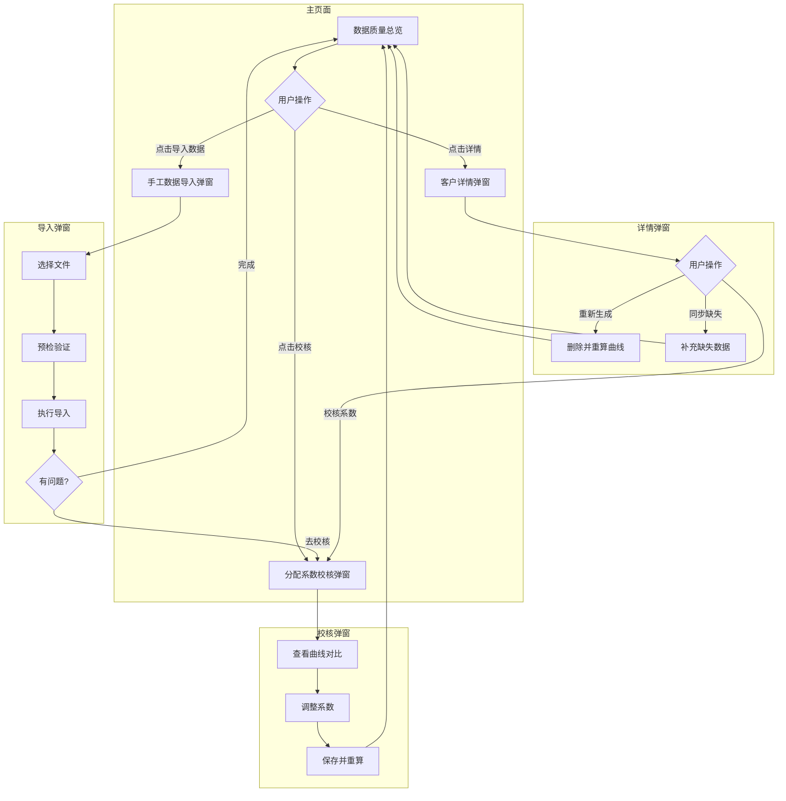

# 负荷数据校核模块 - UI设计文档

**版本**: 1.3  
**日期**: 2026-01-07  
**关联文档**: [负荷数据校验功能-业务需求文档v1.3](./负荷数据校验功能-业务需求文档v1.2.md)

---

## 1. 模块概述

### 1.1 功能定位

负荷数据校核模块为电力交易员和客户经理提供**已签约客户**的负荷数据管理：
1. **数据质量分析**：监控签约客户统一负荷曲线（`unified_load_curve`）的完整性
2. **手工数据导入**：批量导入电表示数数据，自动校验准确性
3. **数据补录**：处理原始数据已存在但统一曲线未生成的情况
4. **分配系数校核**：验证和优化电表-计量点分配系数

> [!NOTE]
> 本模块仅处理**已签约客户**（RPA中有数据的客户）。非签约客户的数据存储在 `temporary_load_curve`，不在本页面展示。

### 1.2 页面结构

采用**单页面 + 弹窗**模式：

```
负荷数据校核 (一级菜单/页面)
  │
  ├─ 主页面：数据质量总览（仅签约客户）
  │     • 统计卡片（健康/警告/严重）
  │     • 客户列表表格
  │     • 操作入口：[同步曲线] [导入数据] [详情] [校核]
  │
  ├─ [弹窗] 手工数据导入
  │
  ├─ [弹窗] 客户详情
  │
  └─ [弹窗] 分配系数校核
```

---

## 2. 数据质量总览（主页面）

### 2.1 功能说明

本页面展示**已签约客户**的 `unified_load_curve`（统一负荷曲线）数据质量情况。

### 2.2 页面布局

```
┌─────────────────────────────────────────────────────────────────────────────┐
│  负荷数据校核                                    [同步曲线] [导入数据]       │
├─────────────────────────────────────────────────────────────────────────────┤
│                                                                              │
│  ┌──────────────┐ ┌──────────────┐ ┌──────────────┐                          │
│  │  🟢 健康      │ │  🟡 警告      │ │  🔴 严重      │                          │
│  │    12 户     │ │     5 户     │ │     2 户     │                          │
│  └──────────────┘ └──────────────┘ └──────────────┘                          │
│                                                                              │
│  ┌──────────────────────────────────────────────────────────────────────────┐│
│  │ 筛选器: [状态 ▼] [校验状态 ▼] [🔍 搜索客户]                               ││
│  ├──────────────────────────────────────────────────────────────────────────┤│
│  │ # │ 客户名称  │ 校验 │ 完整率 │ 总天数│ 缺失 │ 起始日期  │ 截止日期  │ 操作      ││
│  │ 1 │ 江西xx公司│ ✓   │ 95%   │ 98天 │ 5天 │ 2025-10-01│ 2026-01-06│[详情][校核]││
│  │ 2 │ 南昌xx厂  │ ⚠   │ 78%   │ 53天 │ 12天│ 2025-11-15│ 2026-01-06│[详情][校核]││
│  │ 3 │ 新余xx矿  │ ✗   │ -     │ 0天  │ -   │ -         │ -         │[详情][校核]││
│  └──────────────────────────────────────────────────────────────────────────┘│
│                                                                              │
└─────────────────────────────────────────────────────────────────────────────┘
```

### 2.3 统计卡片

| 卡片 | 颜色 | 数据来源 | 点击行为 |
|------|------|---------|---------|
| 健康 (≥90%) | 🟢 绿色 | 完整率≥90%的客户数 | 筛选表格 |
| 警告 (70-89%) | 🟡 黄色 | 完整率70-89%的客户数 | 筛选表格 |
| 严重 (<70%) | 🔴 红色 | 完整率<70%的客户数 | 筛选表格 |

### 2.4 客户列表表格

数据来源：`unified_load_curve`（仅签约客户）

| 列名 | 说明 | 排序 |
|------|------|------|
| 客户名称 | 客户档案中的名称 | ✓ |
| 校验状态 | ✓已校核 / ⚠待校核 / ✗未通过 | ✓ |
| 完整率 | 有效天数 / 总天数 × 100% | ✓ |
| 总天数 | 起始到截止范围内的总天数 | ✓ |
| 缺失天数 | 范围内无数据的天数 | ✓ |
| 起始日期 | 最早记录日期 | ✓ |
| 截止日期 | 最新记录日期 | ✓ |
| 操作 | [详情] [校核] | - |

### 2.5 页面操作入口

| 操作 | 触发位置 | 目标 |
|------|---------|------|
| **同步曲线** | 页面右上角按钮 | 扫描原始数据，对缺失的统一曲线执行聚合计算 |
| **导入数据** | 页面右上角按钮 | 打开手工数据导入弹窗 |
| **详情** | 表格行操作列 | 打开客户详情弹窗 |
| **校核** | 表格行操作列 | 打开分配系数校核弹窗 |

---

## 3. 手工数据导入弹窗

### 3.1 弹窗布局

整个导入流程在单个页面内完成，支持选择目录或单个文件。

```
┌────────────────────────────────────────────────────────────────────────┐
│ 手工数据导入                                                     [✕]  │
├────────────────────────────────────────────────────────────────────────┤
│                                                                         │
│  ┌─ 文件选择 ──────────────────────────────────────────────────────────┐│
│  │                                                                      ││
│  │   📁 拖拽文件到此处，或 [选择目录] [选择文件]                        ││
│  │                                                                      ││
│  │   支持格式: .xlsx, .xls                                              ││
│  │                                                                      ││
│  └──────────────────────────────────────────────────────────────────────┘│
│                                                                         │
│  ┌─ 待导入文件列表 ────────────────────────────────────────────────────┐│
│  │ # │ 文件名                   │ 电表号          │ 客户         │ 状态 ││
│  │ 1 │ 3630001492249...xlsx     │ 3630001492249.. │ 江西xx公司   │ ✓    ││
│  │ 2 │ 3630001492250...xlsx     │ 3630001492250.. │ 江西xx公司   │ ✓    ││
│  │ 3 │ 3630001492251...xlsx     │ 3630001492251.. │ 南昌xx厂     │ ✓    ││
│  │ 4 │ unknown_file.xlsx        │ 无法识别       │ -           │ ⚠    ││
│  │                                                                      ││
│  │ 共 4 个文件 | 可导入 3 个 | 异常 1 个                                ││
│  └──────────────────────────────────────────────────────────────────────┘│
│                                                                         │
│                                             [清空]      [导入]          │
│                                                                         │
├────────────────────────────────────────────────────────────────────────┤
│ 【导入执行中...】                                                       │
│                                                                         │
│  进度: ████████████░░░░░░░░ 60%                                        │
│  当前: 3630001492249...xlsx → 阶段二: 聚合计算中...                     │
│                                                                         │
├────────────────────────────────────────────────────────────────────────┤
│ 【导入结果】                                                            │
│                                                                         │
│  ┌─ 阶段一：原始落库 (raw_meter_data) ────────────────────────────────┐ │
│  │ ✓ 成功 3 个文件 | 涉及 2 个客户 | 数据范围 90 天                   │ │
│  └────────────────────────────────────────────────────────────────────┘ │
│                                                                         │
│  ┌─ 阶段二：聚合计算 (unified_load_curve) ────────────────────────────┐ │
│  │ 统计: 成功 1 个 | 校核未通过 1 个                                  │ │
│  │                                                                    │ │
│  │ ┌───────────────────────────────────────────────────────────────┐ │ │
│  │ │ 客户名称        │ 聚合结果        │ 原因/偏差                 │ │ │
│  │ │ 江西xx公司      │ ✓ 成功         │ 偏差 0.5%                 │ │ │
│  │ │ 南昌xx厂        │ ✗ 校核未通过   │ 偏差 3.2%                 │ │ │
│  │ └───────────────────────────────────────────────────────────────┘ │ │
│  └────────────────────────────────────────────────────────────────────┘ │
│                                                                         │
│                                             [关闭]                      │
│                                                                         │
└────────────────────────────────────────────────────────────────────────┘
```

### 3.2 操作说明

| 操作 | 说明 |
|------|------|
| **选择目录** | 选择包含Excel文件的目录，自动扫描目录下所有 `.xlsx`/`.xls` 文件 |
| **选择文件** | 选择单个或多个Excel文件 |
| **清空** | 清空当前待导入文件列表 |
| **导入** | 执行导入，依次处理阶段一（原始落库）和阶段二（聚合计算） |

### 3.3 两阶段处理说明

| 阶段 | 数据存储 | 处理说明 |
|------|---------|---------|
| **阶段一：原始落库** | `raw_meter_data` | 将Excel中的电表示数按日宽表结构存储，仅做格式转换和去重 |
| **阶段二：聚合计算** | `unified_load_curve` | 根据客户档案中的倍率和分配系数，计算用户级负荷曲线 |

> [!NOTE]
> `raw_mp_data`（RPA数据）由外部项目采集，本模块通过定时任务触发其聚合计算。若定时任务失败，可在"客户详情"中使用"同步缺失"功能补录。

### 3.4 聚合结果状态

| 状态 | 图标 | 含义 | 后续操作 |
|------|------|------|---------|
| **成功** | ✓ | 偏差≤1%，已写入 `unified_load_curve` | 无需操作 |
| **校核未通过** | ✗ | 偏差>1%，曲线生成被拦截 | 关闭弹窗后从主页面进入校核 |
| **临时曲线** | ℹ | 未签约客户，已写入 `temporary_load_curve` | 客户签约后自动迁移 |

---

## 4. 客户详情弹窗

### 4.1 弹窗布局

```
┌────────────────────────────────────────────────────────────────────────┐
│ 🏢 江西xx物资公司 - 数据质量详情                                  [✕]  │
├────────────────────────────────────────────────────────────────────────┤
│                                                                         │
│ ┌─ 数据统计概览 ──────────────────────────────────────────────────────┐│
│ │                                                                      ││
│ │  ┌────────────────┐  ┌────────────────┐  ┌────────────────┐         ││
│ │  │ unified_load   │  │ raw_meter_data │  │ raw_mp_data    │         ││
│ │  │ (统一曲线)     │  │ (手工数据)     │  │ (RPA数据)      │         ││
│ │  ├────────────────┤  ├────────────────┤  ├────────────────┤         ││
│ │  │ 记录天数: 92天 │  │ 记录天数: 120天│  │ 记录天数: 30天 │         ││
│ │  │ 起始: 10-01   │  │ 起始: 08-15   │  │ 起始: 12-08   │         ││
│ │  │ 截止: 01-06   │  │ 截止: 01-05   │  │ 截止: 01-06   │         ││
│ │  │ 缺失: 5天     │  │ 缺失: 8天     │  │ 缺失: 0天     │         ││
│ │  └────────────────┘  └────────────────┘  └────────────────┘         ││
│ │                                                                      ││
│ └──────────────────────────────────────────────────────────────────────┘│
│                                                                         │
│ ┌─ 统一曲线缺失日期明细 ──────────────────────────────────────────────┐│
│ │                                                                      ││
│ │  缺失日期 (共5天):                                                   ││
│ │  • 2025-11-22 (周六) — 原因: 两个原始数据集均无记录                  ││
│ │  • 2025-11-23 (周日) — 原因: 两个原始数据集均无记录                  ││
│ │  • 2025-12-25 (周三) — 原因: 手工数据存在，系数未校核 🔧             ││
│ │  • 2025-12-31 (周二) — 原因: 手工数据存在，系数未校核 🔧             ││
│ │  • 2026-01-01 (周三) — 原因: 两个原始数据集均无记录                  ││
│ │                                                                      ││
│ │  🔧 可通过"同步缺失"或"校核系数"修复                                ││
│ │                                                                      ││
│ └──────────────────────────────────────────────────────────────────────┘│
│                                                                         │
│ ┌─ 电表信息 ──────────────────────────────────────────────────────────┐│
│ │ 电表号              │ 倍率  │ 分配系数 │ 校核状态 │ 最后更新        ││
│ │ 3630001492249...    │ 80    │ 65%     │ ✓ 已校核 │ 2026-01-05     ││
│ │ 3630001492250...    │ 80    │ 25%     │ ✓ 已校核 │ 2026-01-05     ││
│ │ 3630001492251...    │ 40    │ -       │ ⚠ 待校核 │ 2026-01-03     ││
│ └──────────────────────────────────────────────────────────────────────┘│
│                                                                         │
│            [重新生成]      [同步缺失]      [校核系数]      [关闭]       │
│                                                                         │
└────────────────────────────────────────────────────────────────────────┘
```

### 4.2 操作按钮说明

| 操作 | 功能 | 适用场景 |
|------|------|---------|
| **重新生成** | 删除该客户的 `unified_load_curve` 并根据当前系数重新计算所有历史数据 | 怀疑曲线数据有问题，需要完全重算 |
| **同步缺失** | 检查 `raw_meter_data` 和 `raw_mp_data`，补充 `unified_load_curve` 中缺失的数据 | **原始数据已存在，但聚合过程未正确执行**（常见场景） |
| **校核系数** | 打开分配系数校核弹窗 | 偏差超限或系数为空的客户 |

### 4.3 同步缺失功能详解

**适用场景**：当原始层数据（`raw_meter_data` 或 `raw_mp_data`）已存在，但由于以下原因未生成统一曲线：
- 导入时系数未校核，聚合被拦截
- 定时任务执行失败
- 系统异常中断

**执行逻辑**：
1. 扫描 `unified_load_curve` 缺失的日期
2. 检查对应日期的原始数据
3. 对于原始数据存在的日期，使用当前系数执行聚合计算
4. 写入 `unified_load_curve`

---

## 5. 分配系数校核弹窗

### 5.1 触发方式

| 来源 | 说明 |
|------|------|
| 主页面表格 [校核] 按钮 | 直接打开指定客户的校核弹窗 |
| 客户详情弹窗 [校核系数] 按钮 | 关闭详情弹窗，打开校核弹窗 |
| 导入完成 [去校核] 按钮 | 关闭导入弹窗，打开校核弹窗 |

### 5.2 弹窗布局

```
┌────────────────────────────────────────────────────────────────────────┐
│ 分配系数校核 - 江西xx物资公司                                    [✕]  │
├────────────────────────────────────────────────────────────────────────┤
│                                                                         │
│  校核日期: [◀] [2025-12-31] [▶]    [刷新数据]                          │
│                                                                         │
│ ┌─ 曲线对比图 ────────────────────────────────────────────────────────┐│
│ │                                                            [全屏]   ││
│ │  ─── RPA真值 (用户级)                                              ││
│ │  - - 手工拟合 (当前系数)                                           ││
│ │  ··· 手工拟合 (推荐系数)                                           ││
│ │                                                                     ││
│ │       ↑电量(MWh)                                                   ││
│ │     2.0│    ╱╲                                                     ││
│ │     1.5│   ╱  ╲   ╱╲                                               ││
│ │     1.0│  ╱    ╲╱   ╲                                              ││
│ │     0.5│ ╱           ╲                                             ││
│ │     0.0└──────────────────→ 时间                                   ││
│ │        00:00  06:00  12:00  18:00  24:00                           ││
│ │                                                                     ││
│ └──────────────────────────────────────────────────────────────────────┘│
│                                                                         │
│ ┌─ 系数调整面板 ──────────────────────────────────────────────────────┐│
│ │ 电表号              │ 当前系数 │ 推荐系数 │ 调整值                  ││
│ │ 3630001492249...    │ 65%     │ 62.3%   │ [____62.3___] %         ││
│ │ 3630001492250...    │ 25%     │ 27.7%   │ [____27.7___] %         ││
│ │ 3630001492251...    │ -       │ 10.0%   │ [____10.0___] %         ││
│ │                     │         │         │ 总计: 100.0%            ││
│ ├──────────────────────────────────────────────────────────────────────┤│
│ │ 当前偏差: 3.2%      推荐系数后预计偏差: 0.8%                        ││
│ └──────────────────────────────────────────────────────────────────────┘│
│                                                                         │
│        [计算推荐系数]    [应用推荐系数]    [保存并重算]    [取消]       │
│                                                                         │
└────────────────────────────────────────────────────────────────────────┘
```

### 5.3 操作说明

| 操作 | 功能 | 说明 |
|------|------|------|
| **计算推荐系数** | 使用最小二乘法计算最优系数 | 基于选定日期的RPA数据求解 |
| **应用推荐系数** | 将推荐系数填入调整值输入框 | 方便用户一键接受推荐 |
| **保存并重算** | 保存系数到客户档案，并重新生成统一曲线 | 完成校核闭环 |

### 5.4 系数约束校验

| 校验规则 | 触发条件 | 提示信息 |
|---------|---------|---------|
| 非负校验 | 输入值 < 0 | "分配系数不能为负数" |
| 上界校验 | 输入值 > 100 | "单表分配系数不能超过100%" |
| 总和校验 | Σ系数 > 100 | "所有电表的分配系数总和不能超过100%" |

---

## 6. 整体操作流程

### 6.1 主流程图



### 6.2 典型用户场景

| 场景 | 操作路径 |
|------|---------|
| **日常导入新数据** | 导入数据 → 完成 |
| **查看客户数据质量** | 详情 → 查看统计 → 关闭 |
| **补录缺失数据（原始已存在）** | 详情 → 同步缺失 → 完成 |
| **新客户首次校核** | 校核 → 计算推荐 → 应用 → 保存并重算 |
| **修复偏差超限** | 导入 → 去校核 → 调整系数 → 保存并重算 |

---

## 7. 移动端适配

### 7.1 响应式布局要点

| 组件 | 桌面端 | 移动端 |
|------|--------|--------|
| 统计卡片 | 一行3个 | 一行1个，垂直排列 |
| 表格 | 完整显示 | 横向滚动，客户名称列固定 |
| 弹窗 | 居中弹出（宽度70%） | 全屏抽屉（从底部滑出） |
| 曲线图 | 正常尺寸 | 支持横屏全屏（`useChartFullscreen`） |
| 步骤指示器 | 水平排列 | 垂直排列或简化 |

### 7.2 图表全屏功能

所有曲线图均需支持 `useChartFullscreen` Hook，参考项目规范。

---

## 8. API接口规划

### 8.1 数据质量分析

| 接口 | 方法 | 路径 | 说明 |
|------|------|------|------|
| 获取质量统计 | GET | `/api/v1/load-data/quality/summary` | 返回健康/警告/严重客户数 |
| 获取客户列表 | GET | `/api/v1/load-data/quality/customers` | 分页+筛选 |
| 获取客户详情 | GET | `/api/v1/load-data/quality/customers/{id}` | 三个数据集统计+缺失明细 |

### 8.2 手工数据导入

| 接口 | 方法 | 路径 | 说明 |
|------|------|------|------|
| 预检文件 | POST | `/api/v1/load-data/import/validate` | 批量文件预检验证 |
| 执行导入 | POST | `/api/v1/load-data/import/execute` | 批量导入（返回task_id） |
| 查询进度 | GET | `/api/v1/load-data/import/progress/{task_id}` | 轮询导入进度 |

### 8.3 数据补录

| 接口 | 方法 | 路径 | 说明 |
|------|------|------|------|
| 重新生成曲线 | POST | `/api/v1/load-data/regenerate/{customer_id}` | 删除并重算 |
| 同步缺失数据 | POST | `/api/v1/load-data/sync-missing/{customer_id}` | 补充缺失 |

### 8.4 分配系数校核

| 接口 | 方法 | 路径 | 说明 |
|------|------|------|------|
| 获取对比数据 | GET | `/api/v1/load-data/calibration/compare` | 曲线对比数据 |
| 计算推荐系数 | POST | `/api/v1/load-data/calibration/recommend` | 最小二乘法求解 |
| 保存系数并重算 | PUT | `/api/v1/load-data/calibration/save` | 更新档案+重新生成曲线 |

---

## 9. 版本历史

| 版本 | 日期 | 修订内容 | 修订人 |
|------|------|---------|--------|
| 1.0 | 2026-01-07 | 初始版本（三Tab结构） | Gemini |
| 1.1 | 2026-01-07 | 改为单页面+弹窗模式；手工导入改为一站式流程；增加同步缺失功能说明 | Gemini |
| 1.2 | 2026-01-07 | 优化导入结果展示，区分两阶段（原始落库/聚合计算）；增加聚合状态说明 | Gemini |

---

**文档结束**
