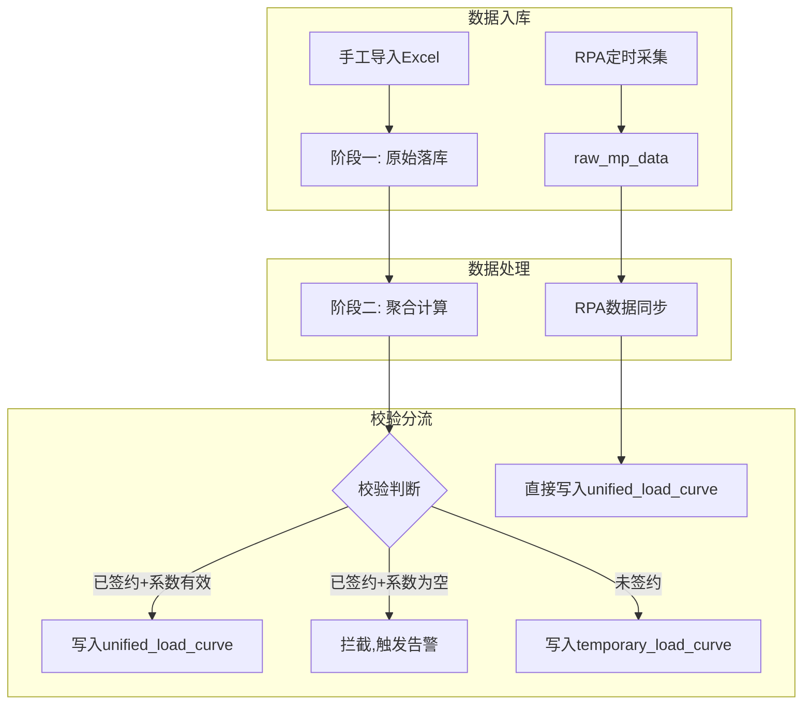
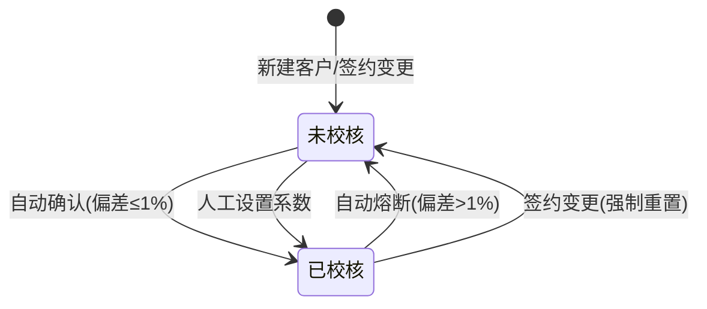
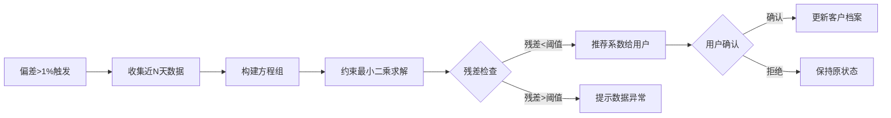

# 负荷数据校验功能 - 业务需求文档 v1.3

**版本**: 1.3  
**日期**: 2026-01-07  
**修订**: 新增分配系数自动优化算法（约束最小二乘法）

---

## 1. 概述

### 1.1 业务背景

电力交易系统需要准确的用户负荷数据用于负荷预测、交易结算和用电分析。系统存在两种负荷数据来源：

| 数据源 | 手工导入数据 | RPA采集数据 |
|--------|-------------|-------------|
| **来源** | 电力交易中心（手工导入Excel） | 电力交易中心（RPA自动爬取） |
| **用途** | 负荷预测、曲线展示、用电特征分析 | 交易结算（权威数据） |
| **粒度** | 96点/日（15分钟） | 48点/日（30分钟） |
| **数据类型** | 电能表示数（累计值） | 计量点电量（差值，MWh） |
| **时效性** | T-1（昨日数据） | T-2（前天数据） |
| **数据周期** | 可达1年以上 | 仅客户签约后 |
| **权威性** | 较低（自行处理） | 高（官方处理） |

> [!IMPORTANT]
> **核心问题**：两种数据本质上同源（电力交易中心），但手工数据中的**电表-计量点分配系数是估算的**，可能存在较大误差。本功能的核心目标是**通过与权威RPA数据对比，验证和优化分配系数**。

### 1.2 业务目标

1. **数据导入**：提供手工导入接口，支持批量导入电表示数数据
2. **准确性校验**：将手工数据与RPA数据对比，验证分配系数的准确性
3. **完整性分析**：监控数据断点和缺失，提供可视化分析报告

---

## 2. 数据模型

### 2.1 实体关系

```
用户 (Customer)
  └─ 户号 (Utility Account) [1:N]
       └─ 电表 (Meter) [1:N]
            └─ 计量点 (Metering Point) [M:N，通过分配系数关联]
                 └─ 分配系数 (allocation_percentage)
```

**关键约束**：
- 一个电表可对应多个计量点
- 每个电表下所有计量点的分配系数之和 ≤ 100%
- 单个分配系数取值范围：0% ~ 100%

### 2.2 数据存储架构

```
┌─────────────────────────────────────────────────────────────────┐
│                        原始数据层                                 │
├─────────────────────────────┬───────────────────────────────────┤
│  raw_meter_data (手工源)     │  raw_mp_data (RPA源)              │
│  • meter_id, date           │  • mp_id, date                   │
│  • readings: [96点示数]      │  • load_values: [48点电量/MWh]    │
│  • meta: {customer, account}│  • meta: {customer, account}     │
└─────────────────────────────┴───────────────────────────────────┘
                              ↓ 融合生成
┌─────────────────────────────────────────────────────────────────┐
│                       标准化数据层                                │
├─────────────────────────────────────────────────────────────────┤
│  unified_load_curve (统一曲线)                                   │
│  • customer_name, datetime, load_value(MWh), source(rpa/manual) │
└─────────────────────────────────────────────────────────────────┘
                              ↓ 分流
┌─────────────────────────────────────────────────────────────────┐
│  temporary_load_curve (临时曲线) - 仅存储未签约客户数据            │
└─────────────────────────────────────────────────────────────────┘
```

---

## 3. 核心业务流程

### 3.1 流程总览



### 3.2 RPA数据同步流程

**触发方式**：定时任务（每日02:00）或手动触发

**处理逻辑**：
1. 从 `raw_mp_data` 读取指定日期的计量点数据
2. 根据客户名称匹配 `customers` 档案（未匹配则自动建档+告警）
3. 聚合计算：`User_Load[t] = Σ(MP_Load[t])`（直接求和，无需分配系数）
4. 写入 `unified_load_curve`，标记 `source='rpa'`，**强制覆盖**同时间点记录

> [!NOTE]
> RPA数据具有最高优先级，任何已存在的手工数据都会被RPA数据覆盖。

### 3.3 手工数据处理流程（两阶段）

#### 阶段一：原始数据落库

**目标**：无条件保留所有格式合法的原始示数数据

| 步骤 | 操作 | 说明 |
|------|------|------|
| 1 | 身份识别 | 从文件名提取电表号，与文件内容交叉验证 |
| 2 | 格式重塑 | 识别96点/1440点格式，提取15分钟粒度数据，按日宽表结构存储 |
| 3 | 增量入库 | 基于 `(Meter_ID, Date)` 去重，仅插入新记录 |

> [!TIP]
> 此阶段**不校验电表是否在档案中**，确保数据不因业务配置问题而丢失。

#### 阶段二：聚合生成

**触发方式**：阶段一完成后自动触发，或定时任务/手动触发

**处理流程**：

```
1. 档案匹配
   ├─ 获取倍率 (multiplier)
   ├─ 获取分配系数 (allocation_ratio)
   └─ 未建档电表 → 记录"游离电表"告警

2. 数据清洗（在计算差值前执行）
   ├─ 优先：历史廓形填充（使用T-1日波动廓形，计算缩放因子补全）
   ├─ 兜底：线性插值
   └─ 异常处理：检测回落（翻转或脏数据）

3. 差分计算与频度对齐
   ├─ Load_96[t] = (Reading[t] - Reading[t-1]) × multiplier
   └─ Load_48[i] = Load_96[2i] + Load_96[2i+1]  (96转48对齐)

4. 用户级聚合
   └─ User_Load[t] = Σ(Load_48_Meter_i[t] × Ratio_i) / 1000 (MWh)
      注：Ratio为空时临时按1.0处理

5. 审计校验 → 见第4节
```

---

## 4. 分配系数校核机制

### 4.1 校核状态判定

系统采用**隐式状态判定**，不设独立状态位：

| 条件 | 状态 | 说明 |
|------|------|------|
| 所有电表的 `allocation_ratio` 均不为空 | 已校核 | 可生成统一曲线 |
| 存在任一电表的 `allocation_ratio` 为空 | 未校核 | 需校核后才能生成 |

**状态流转**：



### 4.2 校验算法

#### 偏差计算

当存在RPA真值时，计算手工数据与RPA数据的总电量偏差：

```
偏差率 = |Manual_Total - RPA_Total| / RPA_Total × 100%
```

#### 校验结果处理

| 偏差率 | 结果 | 系统动作 |
|--------|------|---------|
| ≤ 1% | 通过 | 若系数原为空，自动设为1.0并保存 |
| > 1% | 失败 | 保持/重置系数为空，触发校核告警 |

### 4.3 签约状态判定

**判定规则**：客户是否已签约，取决于 `raw_mp_data`（RPA数据）中是否存在该客户的记录。

| RPA数据状态 | 客户状态 | 说明 |
|------------|---------|------|
| 存在该客户数据 | 已签约 | 可与RPA真值比对，执行校核流程 |
| 不存在该客户数据 | 未签约 | 无法校核，数据写入临时曲线 |

> [!NOTE]
> 此设计简化了签约状态管理，无需在客户档案中维护独立的签约状态字段。

### 4.4 数据分流规则

| 客户状态 | 系数状态 | 目标存储 | 说明 |
|----------|---------|---------|------|
| 已签约（RPA有数据） | 有效（非空） | `unified_load_curve` | 标记 `source='manual'` |
| 已签约（RPA有数据） | 无效（空） | **拦截** | 不生成曲线，提示需校核 |
| 未签约（RPA无数据） | 任意 | `temporary_load_curve` | 仅供分析使用 |

> [!WARNING]
> 已签约客户的手工数据必须通过校核（偏差≤1%）才能进入核心业务库。

### 4.5 分配系数自动优化算法

当手工数据与RPA数据偏差超过阈值时，系统可使用**约束最小二乘法**自动计算最优分配系数。

#### 数学模型

**问题定义**：已知用户有 n 块电表，设第 i 块电表的分配系数为 $a_i$，则：

$$
E_{rpa}[t] = \sum_{i=1}^{n} E_{meter_i}[t] \times a_i
$$

其中：
- $E_{rpa}[t]$：RPA采集的用户级48点电量（真值）
- $E_{meter_i}[t]$：第 i 块电表经差分、倍率计算后的48点电量
- $a_i$：待求解的分配系数

**目标函数**（最小化残差平方和）：

$$
\min_{a_1, ..., a_n} \sum_{t=1}^{T} \left( E_{rpa}[t] - \sum_{i=1}^{n} E_{meter_i}[t] \times a_i \right)^2
$$

#### 约束条件

| 约束类型 | 数学表达式 | 业务含义 |
|---------|-----------|---------|
| 非负约束 | $a_i \geq 0$ | 系数不能为负 |
| 上界约束 | $a_i \leq 1$ | 单表系数不超过100% |
| 总和约束 | $\sum_{i=1}^{n} a_i \leq 1$ | 各表系数总和不超过100% |

#### 求解方法

这是一个**带约束的线性最小二乘问题**，可使用以下方法求解：

1. **scipy.optimize.lsq_linear**（推荐）
   ```python
   from scipy.optimize import lsq_linear
   
   # A: (T, n) 电表电量矩阵，每列是一块电表的T个时间点电量
   # b: (T,) RPA用户电量向量
   result = lsq_linear(A, b, bounds=(0, 1))
   coefficients = result.x  # 各电表的分配系数
   ```

2. **带总和约束的二次规划**
   - 使用 `cvxpy` 或 `scipy.optimize.minimize` 添加 `Σa_i ≤ 1` 约束

#### 样本选取策略

| 策略 | 样本数 T | 适用场景 | 说明 |
|------|---------|---------|------|
| 单日48点 | 48 | 快速验证 | 使用单日数据，适合初步估算 |
| 多日聚合 | 48 × D | 稳定求解 | 取连续D天数据（建议7~30天），提高鲁棒性 |
| 日电量 | D | 简化模型 | 按日聚合后求解，减少噪声影响 |

> [!TIP]
> **推荐方案**：使用连续7天的数据（336个样本点），在稳定性和计算效率间取得平衡。

#### 应用流程



#### 结果输出

| 输出项 | 说明 |
|-------|------|
| 推荐系数 `a_i` | 各电表的最优分配系数（百分比） |
| 拟合残差 | 使用推荐系数后的预期偏差率 |
| 置信度评估 | 基于样本量和残差判断可信度 |

> [!IMPORTANT]
> 自动计算的系数仅作为**推荐值**呈现给用户，需人工确认后才写入档案。这是为了防止异常数据导致的错误系数被自动应用。

---

## 5. 完整性分析

### 5.1 完整度等级

| 等级 | 完整度范围 | 状态 | 建议操作 |
|------|-----------|------|---------|
| 健康 | ≥ 90% | 🟢 绿色 | 保持现状 |
| 警告 | 70% ~ 89% | 🟡 黄色 | 建议补充数据 |
| 严重 | < 70% | 🔴 红色 | 必须补充数据 |

### 5.2 历史数据补全

**原则**：手工数据的核心价值在于**补充历史空缺**。

**自动补全逻辑**：
1. 对比 `unified_load_curve` 现有记录
2. 对于缺失的历史时间点，若 `raw_meter_data` 中存在有效原始数据
3. 按当前分配参数计算，插入 `unified_load_curve`（标记 `source='manual'`）

---

## 6. 特殊场景处理

### 6.1 换表事件

**发生频率**：极小

**处理方式**：数据库手工修正

**步骤**：
1. 更新 `customers` 档案中的电表ID
2. （可选）标记 `raw_meter_data` 中的历史数据
3. 换表后需重新校核分配系数

> [!CAUTION]
> 不建议跨换表日期进行校核，换表前后应使用各自的分配系数。

---

## 7. 下游业务调用

统一曲线生成后，下游模块统一从 `unified_load_curve` 获取数据：

| 模块 | 调用方式 | 说明 |
|------|---------|------|
| 负荷预测 | 直接查询 | `manual`数据用于T-1，`rpa`数据用于T-2及更早 |
| 预结算/电量分析 | 直接查询 | 前端根据`source`字段区分展示（实线=RPA，虚线=手工） |

> [!NOTE]
> 下游模块**无需处理数据来源借用逻辑**，统一曲线已完成融合。

---

## 8. 待讨论事项

| 状态 | 事项 | 决策 |
|------|------|------|
| ✅ | 校核周期是否需要支持多周期（1天/7天/30天）？ | 主要1天，可扩展 |
| ✅ | 是否需要自动检测换表事件？ | 不需要，手工处理 |
| ✅ | 分配系数优化的约束条件？ | 每电表≤100%，每计量点0-100% |
| ⏳ | 完整性分析的告警通知机制？ | 待定 |
| ⏳ | 推荐系数的自动应用权限控制？ | 待定 |

---

## 附录：版本历史

| 版本 | 日期 | 修订内容 | 修订人 |
|------|------|---------|--------|
| 1.0 | 2025-11-12 | 初始版本 | 需求方 |
| 1.1 | 2025-11-12 | 明确数据同源性、核心问题、存储策略、校核流程、系数约束规则 | Claude |
| 1.2 | 2026-01-07 | 重新组织文档结构，使业务逻辑更清晰 | Gemini |
| 1.3 | 2026-01-07 | 新增分配系数自动优化算法（约束最小二乘法） | Gemini |

---

**文档结束**