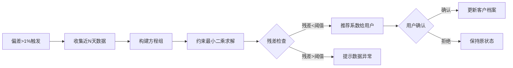

# 负荷数据校验功能 - 业务需求文档 v1.3

**版本**: 1.3  
**日期**: 2026-01-07  
**修订**: 新增分配系数自动优化算法（约束最小二乘法）

---

## 1. 概述

### 1.1 业务背景

电力交易系统需要准确的用户负荷数据用于负荷预测、交易结算和用电分析。系统存在两种负荷数据来源：

| 数据源 | 手工导入数据 | RPA采集数据 |
|--------|-------------|-------------|
| **来源** | 电力交易中心（手工导入Excel） | 电力交易中心（RPA自动爬取） |
| **用途** | 负荷预测、曲线展示、用电特征分析 | 交易结算（权威数据） |
| **粒度** | 96点/日（15分钟） | 48点/日（30分钟） |
| **数据类型** | 电能表示数（累计值） | 计量点电量（差值，MWh） |
| **时效性** | T-1（昨日数据） | T-2（前天数据） |
| **数据周期** | 可达1年以上 | 仅客户签约后 |
| **权威性** | 较低（自行处理） | 高（官方处理） |


### 1.2 业务目标

1. **数据导入**：提供手工导入接口，支持批量导入电表示数数据和计量点电量数据（RPA采集数据）
2. **数据聚合**：提供数据聚合接口，将导入的电表示数数据和计量点电量数据原始数据进行聚合，生成统一的负荷曲线。
3. **数据质量诊断**：分析签约客户统一负荷曲线数据质量，包括断点、计量点缺失、数据误差大等问题，提供整体数据质量诊断信息，并针对单个客户可提供详细的数据诊断，并提供导入和聚合等修复操作接口。电表原始数据和计量点原始数据诊断页面可选。
4. **准确性校验**：提供准确性校验接口，将电表数据与计量点数据生成的负荷曲线对比，找出需要调整的电表分配系数，并提供自动计算方法和手动调整方法操作页面。

---

## 2. 数据模型

### 2.1 实体关系

```
用户 (Customer)
  └─ 户号 (Utility Account) [1:N]
       └─ 电表 (Meter) [1:N]（有的电表部分电量参与电量结算，需乘以分配系数）
            └─ 分配系数 (allocation_percentage)
       └─ 计量点 (Metering Point) [1:N]

**关键约束**：
- 一个用户的电量等于所有计量点电量之和；
- 同样一个用户电量等于所属所有电表电量乘以分配系数，再累加之和；
- 大多数情况分配系数为100%，取值范围：0% ~ 100%


### 2.2 数据存储架构
│                        原始数据层                                 │
├─────────────────────────────┬───────────────────────────────────┤
│  raw_meter_data (手工源)     │  raw_mp_data (RPA源)              │
│  • meter_id, date           │  • mp_id, date                   │
│  • readings: [96点示数]      │  • load_values: [48点电量/MWh]    │
│  • meta: {customer, account}│  • meta: {customer, account}     │
└─────────────────────────────┴───────────────────────────────────┘
                              ↓ 完整性校验 + 融合生成
┌─────────────────────────────────────────────────────────────────┐
│                       统一负荷曲线层 (宽表 + 双数组)               │
├─────────────────────────────────────────────────────────────────┤
│  unified_load_curve                                             │
│  • customer_id, date                                            │
│  • mp_load: {values[48], coverage, missing_mps}                │
│  • meter_load: {values[48], coverage, missing_meters}          │
│  • final_load[48]:后端 API 动态计算                  │
└─────────────────────────────────────────────────────────────────┘
                              ↓ 分流（未签约客户）
┌─────────────────────────────────────────────────────────────────┐
│  temporary_load_curve (临时曲线) - 仅存储未签约客户数据            │
└─────────────────────────────────────────────────────────────────┘
```

---

## 3. 核心业务流程

### 3.1 流程总览

```
flowchart TB
    subgraph 数据入库
        A1[手工导入电表示度Excel] --> B1[阶段一: 原始落库]
        A2[RPA定时采集或手工导入计量点电量Excel] --> B2[raw_mp_data]
    end
    
    subgraph 数据处理
        B1 --> C1[阶段二: 聚合计算]
        B2 --> C2[阶段二: 聚合计算或后端自动化任务RPA数据同步]
    end
    
    subgraph 校验分流
        C1 --> D{校验判断}
        C2 --> E[直接写入unified_load_curve]
        D -->|已签约| F[写入unified_load_curve]
        D -->|未签约| H[写入temporary_load_curve]
    end
```

### 3.2 计量点数据处理流程

#### 阶段一：原始数据落库

**触发方式**：rpa定时爬取（每日01:00）或手动下载原始文件导入触发（一般用于平台数据补录后）

**处理逻辑**：
   按宽表格式，将数据落库到 `raw_mp_data` 表，动态识别 Excel 中的时段列数量，支持 24 点、48 点或 96 点数据导入。

#### 阶段二：聚合生成

**触发方式**：定时任务（每日02:00）或手动触发

**处理逻辑**：
1. **档案完整性验证** 通过客户ID查询 customer_archives 获取该客户所有关联的计量点列表 (expected_mps)，若无档案则终止聚合。
2. **数据完整性检查** 查询 `raw_mp_data` 中该日的所有计量点数据，比对预期列表。
 - 计算覆盖率：coverage = 实有计量点数 / 应有计量点数。
 -  标记缺失点：记录 missing_mps 列表，便于后续诊断。
3. **多点电量叠加** 遍历所有实有计量点的 48 点负荷数据，按时段进行累加（Sum），生成属于该客户的总负荷曲线（values）。
4. **自动汇总校验** 对聚合后的 48 点曲线进行求和，计算日总电量 (
total)，作为快速校验和统计依据。
5. **异常容错** 若某日无任何计量点数据，返回 None；若仅有部分数据，仍执行聚合但覆盖率会小于 1.0，业务层可根据覆盖率阈值决定是否采信数据。

> [!NOTE]
> - 电量空值视为0处理，不影响其他点叠加。

### 3.3 电表数据处理流程

#### 阶段一：原始数据落库

**目标**：无条件保留所有格式合法的原始示数数据

| 步骤 | 操作 | 说明 |
|------|------|------|
| 1 | 身份识别 | 从文件名提取电表号，与文件内容交叉验证 |
| 2 | 格式重塑 | 识别96点/1440点格式，提取15分钟粒度数据，按日宽表结构存储 |
| 3 | 增量入库 | 基于 `(Meter_ID, Date)` 去重，仅插入新记录 |

> [!TIP]
> 此阶段**不校验电表是否在档案中**，确保数据不因业务配置问题而丢失。

#### 阶段二：聚合生成

**触发方式**：阶段一完成后自动触发，或定时任务/手动触发

**处理流程**：

1. **完整性强校验**
   聚合前严格检查该客户名下所有电表当日数据是否齐备。**任意一块电表缺失数据（包括新装表未采集到），则整户数据视为无效**，直接终止聚合，避免生成错误的总负荷。

2. **高级清洗与插值**
   - **异常回落清洗**：检测示数“倒走”（`Current < Previous`）情况，标记为脏数据并置零，防止出现负负荷。
   - **智能补缺**：针对数据缺口，短缺口（≤3点，约1.5小时）采用线性插值；长缺口（>3点）尝试利用**前一日历史廓形**进行拟合填充，无法拟合时降级为线性插值。

3. **差分计算与倍率应用**
   将电表“示数”转换为“负荷”：`Load[t] = (Reading[t] - Reading[t-1]) * Multiplier`。在此阶段统一应用互感器倍率。

4. **多频度归一化 (96转48)**
   自动识别 96 点数据（15分钟/点），通过 `Load_48[i] = Load_96[2i] + Load_96[2i+1]` 累加降维，统一对齐至 48 点（30分钟/点）标准格式。

5. **加权聚合与单位转换**
   应用电表分配系数 (`allocation_ratio`，默认1.0)，按 `Σ(Load_Meter * Ratio) / 1000` 将各分表负荷累加，并将单位从 **kWh 转换为 MWh**，最终生成户级总负荷曲线。

6. **结果落库**
   写入 `unified_load_curve.meter_load` 字段，并同步计算该客户当日总电量用于快速校验。

---


## 4. 分配系数校核机制

### 4.1 校核状态判定

系统采用**隐式状态判定**，不设独立状态位，所有电表的 `allocation_ratio` 默认为1（或空，代表1）。当负荷数据诊断时该客户电表和计量点误差大于1%时，可重新校核分配系数。


### 4.2 校验算法

#### 偏差计算

当存在RPA真值时，计算手工数据与RPA数据的总电量偏差：

```
偏差率 = |Meter_Total - MP_Total| / MP_Total × 100%
```

#### 校验结果处理

| 偏差率 | 结果 | 系统动作 |
|--------|------|---------|
| ≤ 1% | 通过 | 若系数原为空，自动设为1.0并保存 |
| > 1% | 失败 | 保持/重置系数为空，触发校核告警 |


### 4.3 分配系数自动优化算法

当电表数据与计量点数据偏差超过阈值时，系统可使用**约束最小二乘法**自动计算最优分配系数。

#### 数学模型

**问题定义**：已知用户有 n 块电表，设第 i 块电表的分配系数为 $a_i$，则：

$$
E_{mp}[t] = \sum_{i=1}^{n} E_{meter_i}[t] \times a_i
$$

其中：
- $E_{mp}[t]$：计量点采集的用户级48点电量（真值）
- $E_{meter_i}[t]$：第 i 块电表经差分、倍率计算后的48点电量
- $a_i$：待求解的分配系数

**目标函数**（最小化残差平方和）：

$$
\min_{a_1, ..., a_n} \sum_{t=1}^{T} \left( E_{mp}[t] - \sum_{i=1}^{n} E_{meter_i}[t] \times a_i \right)^2
$$

#### 约束条件

| 约束类型 | 数学表达式 | 业务含义 |
|---------|-----------|---------|
| 非负约束 | $a_i \geq 0$ | 系数不能为负 |
| 上界约束 | $a_i \leq 1$ | 单表系数不超过100% |
| 总和约束 | $\sum_{i=1}^{n} a_i \leq 1$ | 各表系数总和不超过100% |

#### 求解方法

这是一个**带约束的线性最小二乘问题**，可使用以下方法求解：

1. **scipy.optimize.lsq_linear**（推荐）
   ```python
   from scipy.optimize import lsq_linear
   
   # A: (T, n) 电表电量矩阵，每列是一块电表的T个时间点电量
   # b: (T,) RPA用户电量向量
   result = lsq_linear(A, b, bounds=(0, 1))
   coefficients = result.x  # 各电表的分配系数
   ```

2. **带总和约束的二次规划**
   - 使用 `cvxpy` 或 `scipy.optimize.minimize` 添加 `Σa_i ≤ 1` 约束

#### 样本选取策略

| 策略 | 样本数 T | 适用场景 | 说明 |
|------|---------|---------|------|
| 单日48点 | 48 | 快速验证 | 使用单日数据，适合初步估算 |
| 多日聚合 | 48 × D | 稳定求解 | 取连续D天数据（建议7~30天），提高鲁棒性 |
| 日电量 | D | 简化模型 | 按日聚合后求解，减少噪声影响 |

> [!TIP]
> **推荐方案**：使用连续7天的数据（336个样本点），在稳定性和计算效率间取得平衡。

#### 应用流程



#### 结果输出

| 输出项 | 说明 |
|-------|------|
| 推荐系数 `a_i` | 各电表的最优分配系数（百分比） |
| 拟合残差 | 使用推荐系数后的预期偏差率 |
| 置信度评估 | 基于样本量和残差判断可信度 |

> [!IMPORTANT]
> 自动计算的系数仅作为**推荐值**呈现给用户，需人工确认后才写入档案。这是为了防止异常数据导致的错误系数被自动应用。

---

## 5. 负荷数据诊断

### 5.1 完整度等级

| 等级 | 完整度范围 | 状态 | 建议操作 |
|------|-----------|------|---------|
| 健康 | ≥ 90% | 🟢 绿色 | 保持现状 |
| 警告 | 70% ~ 89% | 🟡 黄色 | 建议补充数据 |
| 严重 | < 70% | 🔴 红色 | 必须补充数据 |

### 5.2 历史数据补全

**原则**：电表示度数据的核心价值在于**补充历史空缺**。

**自动补全逻辑**：
1. 对比 `unified_load_curve` 现有记录
2. 对于缺失的历史时间点，若 `raw_meter_data` 中存在有效原始数据
3. 按当前分配参数计算，插入 `unified_load_curve`（标记 `source='meter'`）

---
