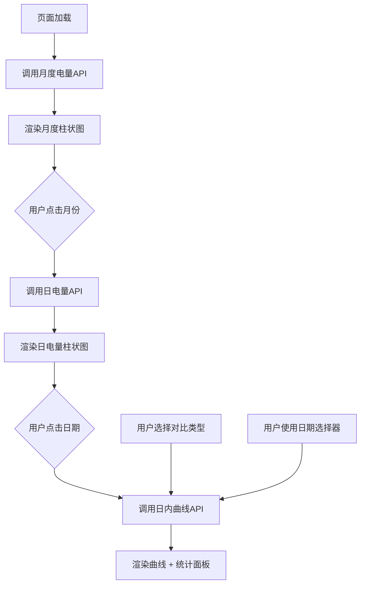

# 整体负荷分析页面重构

## 需求背景

将现有的 [LoadAnalysisPage.tsx](file:///d:/Gitworks/exds-web/frontend/src/pages/LoadAnalysisPage.tsx) 从多 Tab 结构重构为**单页面布局**，聚焦于**所有客户负荷汇总后的宏观分析**，与客户负荷分析页面（个体分析）形成互补。

**核心分析维度**：
- 月度电量趋势（年度对比）
- 日电量分布（月内分布）
- 日内电量曲线（时段分析）
- 尖峰平谷时段电量结构

---

## User Review Required（已确认）

| 问题 | 确认答案 |
|------|----------|
| 节假日数据来源 | 参考 [china_holidays_manual.py](file:///d:/Gitworks/exds-web/china_holidays_manual.py) 构建节假日判断函数 |
| 数据粒度 | **30分钟电量值**（48点/日） |
| 年份范围 | 固定展示 **2025 + 2026** 两年 |
| "上周同期"定义 | **7天前** |
| "去年同期"定义 | **同月同日**（如无数据显示"暂无数据"） |
| 移动端布局 | **单列四区块布局**（需要滚动） |
| 统计指标重点 | **尖峰平谷时段电量分配**（不关注负荷指标） |
| 峰谷差定义 | = (尖峰 + 高峰) / (低谷 + 深谷) |

---

## 页面布局设计

### 桌面端布局（两列）

```
┌─────────────────────────────────────────────────────────────────────────────┐
│                          整体负荷分析                                        │
├────────────────────────────────────┬────────────────────────────────────────┤
│                                    │                                        │
│   【模块1：月度电量柱状图】         │     【模块2：日电量柱状图】             │
│                                    │                                        │
│   2025年: 浅灰色                   │     显示选中月份的每日电量              │
│   2026年: 主题色（蓝色渐变）       │     ┌────┬────┬────┐                   │
│   当月未完整: 虚线边框             │     │工作日│周末│节假日│                │
│                                    │     └────┴────┴────┘                   │
│   点击月份 → 联动右侧              │     点击日期 → 联动下方曲线             │
│                                    │                                        │
├────────────────────────────────────┴────────────────────────────────────────┤
│                                                                             │
│   【模块3：日内48点电量曲线】                                                │
│                                                                             │
│   ┌──────────────────────────────────────────┬─────────────────────────────┐│
│   │                                          │  【模块4：统计信息面板】    ││
│   │   📅 日期选择器    对比: ○昨日 ○上周 ○去年 │                            ││
│   │                                          │  日电量: 12,345 kWh        ││
│   │   [折线图区域]                           │  ─────────────────         ││
│   │   - 选定日: 实线蓝色                     │  时段电量分配:              ││
│   │   - 对比日: 虚线灰色                     │  ┌────┬───────┬───────┐    ││
│   │   - TOU背景色分区                        │  │时段│电量kWh│占比    │    ││
│   │                                          │  ├────┼───────┼───────┤    ││
│   │   支持横屏全屏                           │  │尖峰│ 1,200 │ 9.7%  │    ││
│   │                                          │  │高峰│ 3,500 │28.4%  │    ││
│   │                                          │  │平段│ 4,000 │32.4%  │    ││
│   │                                          │  │低谷│ 2,500 │20.3%  │    ││
│   │                                          │  │深谷│ 1,145 │ 9.2%  │    ││
│   │                                          │  └────┴───────┴───────┘    ││
│   │                                          │  ─────────────────         ││
│   │                                          │  峰谷比: 1.85              ││
│   │                                          │  同比变化: +5.2%           ││
│   └──────────────────────────────────────────┴─────────────────────────────┘│
│                                                                             │
└─────────────────────────────────────────────────────────────────────────────┘
```

### 移动端布局（单列滚动）

```
┌─────────────────────────────┐
│    整体负荷分析              │
├─────────────────────────────┤
│ 【模块1：月度电量柱状图】    │
│ (可横向滚动查看24个月)      │
├─────────────────────────────┤
│ 【模块2：日电量柱状图】      │
│ (可横向滚动查看31天)        │
├─────────────────────────────┤
│ 【模块3：日内电量曲线】      │
│ (支持横屏全屏)              │
├─────────────────────────────┤
│ 【模块4：统计信息面板】      │
│ (时段电量表格)              │
└─────────────────────────────┘
```

---

## 模块详细需求

### 模块1：月度电量柱状图

| 项目 | 说明 |
|------|------|
| **数据范围** | 2025年1月 ~ 2026年12月（共24个月） |
| **柱子颜色** | 2025年：浅灰色 `#E0E0E0`<br>2026年：主题色（蓝色渐变 `#1976D2` → `#42A5F5`） |
| **当月处理** | 若数据不完整，柱子使用**虚线边框 + 渐变填充**标识为累计值 |
| **交互** | 点击某月柱子 → 右侧日电量图更新为该月数据<br>选中月高亮显示 |
| **X轴标签** | `1月 2月 ... 12月 1月 2月 ... 12月`<br>年份分隔线或背景色区分 |
| **Y轴** | 电量（万kWh），自动缩放 |
| **默认选中** | 当前月（2026年1月） |
| **移动端** | 可横向滚动，柱子宽度固定 |

> [!TIP]
> **增强建议**：增加同比对比功能，鼠标悬停时显示 tooltip：`2026年1月: 120万kWh (同比 +5.2%)`

---

### 模块2：日电量柱状图

| 项目 | 说明 |
|------|------|
| **数据范围** | 选中月份的每一天（1~31日） |
| **柱子颜色** | 工作日：主题色 `#1976D2`<br>周末：浅蓝色 `#90CAF9`<br>节假日：橙色 `#FF9800`<br>调休工作日：主题色 + 斜线纹理 |
| **颜色图例** | 右上角显示图例：🔵工作日 🔵周末 🟠节假日 |
| **日期判断** | 使用 [china_holidays_manual.py](file:///d:/Gitworks/exds-web/china_holidays_manual.py) 的 [get_china_day_types()](file:///d:/Gitworks/exds-web/china_holidays_manual.py#84-112) 函数 |
| **交互** | 点击某日柱子 → 下方曲线图更新为该日数据 vs 对比日<br>选中日高亮显示 |
| **X轴标签** | `1 2 3 ... 31`（日期） |
| **Y轴** | 电量（kWh），自动缩放 |
| **默认选中** | 该月最近一个有数据的日期 |
| **空数据处理** | 未来日期不显示柱子，只显示X轴刻度线 |

> [!TIP]
> **增强建议**：增加均值参考线（虚线），显示该月日均电量

---

### 模块3：日内48点电量曲线

| 项目 | 说明 |
|------|------|
| **数据范围** | 选定日的48点电量值（30分钟粒度） |
| **日期选择** | 提供独立日期选择器（支持自由选择日期）<br>也可通过模块2点击日期联动 |
| **对比选项** | Radio按钮组：<br>- ○ 昨日（默认）<br>- ○ 上周同期（7天前）<br>- ○ 去年同期（同月同日） |
| **曲线样式** | 选定日：实线 `#1976D2` 2px<br>对比日：虚线 `#9E9E9E` 1.5px |
| **背景色** | 按TOU时段分区着色：<br>尖峰: `rgba(244, 67, 54, 0.1)`<br>高峰: `rgba(255, 152, 0, 0.1)`<br>平段: `rgba(255, 255, 255, 0)`<br>低谷: `rgba(33, 150, 243, 0.1)`<br>深谷: `rgba(0, 150, 136, 0.1)` |
| **X轴** | `00:30 01:00 ... 24:00`（48个点） |
| **Y轴** | 电量（kWh），自动缩放 |
| **全屏支持** | 使用 `useChartFullscreen` Hook，支持横屏最大化 |
| **响应式高度** | 移动端 350px，桌面端 400px |
| **无数据提示** | 对比日无数据时，显示提示文字，仅展示选定日曲线 |

> [!TIP]
> **增强建议**：
> 1. 支持多日对比（勾选最近7天中的多个日期）
> 2. 增加"工作日均值"作为对比基准选项

---

### 模块4：统计信息面板

| 统计项 | 说明 | 计算方式 |
|--------|------|----------|
| **日电量** | 选定日总电量 | 直接从API获取 |
| **时段电量分配** | 按尖峰/高峰/平段/低谷/深谷分组 | 48点按TOU规则分组求和 |
| **时段占比** | 各时段电量 / 日电量 × 100% | 百分比计算 |
| **峰谷比** | (尖峰 + 高峰) / (低谷 + 深谷) | 反映用电时段结构 |
| **同比变化** | 与对比日电量变化百分比 | (选定日 - 对比日) / 对比日 × 100% |

**显示格式**：
```
┌────────────────────────────────────┐
│  日电量                            │
│  12,345 kWh                        │
│  ──────────────────────────────── │
│  时段电量分配                       │
│  ┌────┬─────────┬───────┐         │
│  │时段 │  电量    │  占比  │         │
│  ├────┼─────────┼───────┤         │
│  │尖峰 │ 1,200   │  9.7% │ ████    │
│  │高峰 │ 3,500   │ 28.4% │ ██████████│
│  │平段 │ 4,000   │ 32.4% │ ███████████│
│  │低谷 │ 2,500   │ 20.3% │ ███████  │
│  │深谷 │ 1,145   │  9.2% │ ████    │
│  └────┴─────────┴───────┘         │
│  ──────────────────────────────── │
│  峰谷比: 1.85                      │
│  同比变化: +5.2% ↑                 │
186: └────────────────────────────────────┘
```

> [!TIP]
> **增强建议**：
> 1. 增加迷你水平条形图，直观展示时段占比
> 2. 峰谷比增加颜色指示：<1.5 绿色（良好）、1.5~2.0 橙色（一般）、>2.0 红色（差）
> 3. 增加"本月累计"和"本年累计"电量汇总

---

## Proposed Changes

### 后端 API

#### [NEW] [v1_total_load.py](file:///d:/Gitworks/exds-web/webapp/api/v1_total_load.py)

新增整体负荷分析 API 路由模块：

```python
# 1. 获取月度电量汇总
GET /api/v1/total-load/monthly
Query: start_month=2025-01, end_month=2026-12
Response: [
  { "month": "2025-01", "consumption": 1200000, "is_complete": true },
  { "month": "2026-01", "consumption": 980000, "is_complete": false }
]

# 2. 获取日电量分布
GET /api/v1/total-load/daily
Query: month=2026-01
Response: [
  { "date": "2026-01-01", "consumption": 45000, "day_type": "holiday", "holiday_name": "元旦" },
  { "date": "2026-01-02", "consumption": 42000, "day_type": "workday" },
  { "date": "2026-01-04", "consumption": 38000, "day_type": "weekend" }
]

# 3. 获取日内电量曲线（含对比）
GET /api/v1/total-load/curve
Query: date=2026-01-26, compare_type=yesterday|last_week|last_year
Response: {
  "target": {
    "date": "2026-01-26",
    "points": [{ "time": "00:30", "consumption": 850, "period_type": "深谷" }, ...],
    "total": 42000,
    "period_breakdown": { "尖峰": 4100, "高峰": 12000, "平段": 13500, "低谷": 8500, "深谷": 3900 }
  },
  "compare": {
    "date": "2026-01-25",
    "points": [...],
    "total": 39800
  } | null
}
```

#### [MODIFY] [main.py](file:///d:/Gitworks/exds-web/webapp/main.py)

注册新路由：
```python
from webapp.api.v1_total_load import router as total_load_router
app.include_router(total_load_router, ...)
```

---

### 后端服务

#### [NEW] [total_load_service.py](file:///d:/Gitworks/exds-web/webapp/services/total_load_service.py)

整体负荷分析业务逻辑：

```python
class TotalLoadService:
    def get_monthly_consumption(start_month: str, end_month: str) -> List[dict]:
        """获取月度电量汇总（聚合所有签约客户）"""
        
    def get_daily_consumption(month: str) -> List[dict]:
        """获取月内日电量分布（含日期类型标注）"""
        
    def get_intraday_curve(date: str, compare_type: str) -> dict:
        """获取日内电量曲线及时段分解"""
```

#### [NEW] [holiday_service.py](file:///d:/Gitworks/exds-web/webapp/services/holiday_service.py)

节假日判断服务（封装 [china_holidays_manual.py](file:///d:/Gitworks/exds-web/china_holidays_manual.py)）：

```python
class HolidayService:
    def get_day_type(date: date) -> str:
        """返回: 'workday' | 'weekend' | 'holiday' | 'adjusted_workday'"""
        
    def get_holiday_name(date: date) -> Optional[str]:
        """如果是节假日，返回节假日名称"""
```

---

### 前端组件

#### [MODIFY] [LoadAnalysisPage.tsx](file:///d:/Gitworks/exds-web/frontend/src/pages/LoadAnalysisPage.tsx)

重构为单页面布局，统一管理状态：

```typescript
interface PageState {
  selectedMonth: string;        // "2026-01"
  selectedDate: string;         // "2026-01-26"
  compareType: 'yesterday' | 'last_week' | 'last_year';
}
```

#### [NEW] [MonthlyConsumptionChart.tsx](file:///d:/Gitworks/exds-web/frontend/src/components/total-load/MonthlyConsumptionChart.tsx)

月度电量柱状图组件

#### [NEW] [DailyConsumptionChart.tsx](file:///d:/Gitworks/exds-web/frontend/src/components/total-load/DailyConsumptionChart.tsx)

日电量柱状图组件（含日期类型颜色标注）

#### [NEW] [IntradayCurveChart.tsx](file:///d:/Gitworks/exds-web/frontend/src/components/total-load/IntradayCurveChart.tsx)

日内电量曲线组件（含TOU背景色、全屏支持）

#### [NEW] [LoadStatisticsPanel.tsx](file:///d:/Gitworks/exds-web/frontend/src/components/total-load/LoadStatisticsPanel.tsx)

统计信息面板组件（时段电量表格 + 峰谷比）

---

## 数据流设计



---

## Verification Plan

### Automated Tests

```bash
# 后端 API 测试
pytest webapp/tests/test_total_load_api.py -v

# 前端构建验证
npm run build --prefix frontend
```

### Manual Verification

1. **月度电量图**
   - [ ] 2025年柱子为浅灰色，2026年为蓝色
   - [ ] 当前月（1月）显示虚线边框（累计值）
   - [ ] 点击月份联动日电量图

2. **日电量图**
   - [ ] 工作日/周末/节假日颜色区分正确
   - [ ] 元旦假期（1月1-3日）显示橙色
   - [ ] 1月4日（调休）显示斜线纹理
   - [ ] 点击日期联动曲线图

3. **日内曲线**
   - [ ] 48点数据完整显示
   - [ ] TOU背景色分区正确
   - [ ] 切换对比类型（昨日/上周/去年）正常
   - [ ] 去年同期无数据时显示提示
   - [ ] 横屏全屏功能正常

4. **统计面板**
   - [ ] 时段电量分配正确
   - [ ] 峰谷比计算正确
   - [ ] 同比变化百分比正确

5. **移动端**
   - [ ] 单列布局正确
   - [ ] 图表可横向滚动
   - [ ] 全屏功能正常

---

## 实施优先级

| 阶段 | 内容 | 预估工时 | 优先级 |
|------|------|----------|--------|
| **Phase 1** | 后端 API + 月度电量柱状图 | 3h | P0 |
| **Phase 2** | 日电量柱状图 + 节假日标注 | 2h | P0 |
| **Phase 3** | 日内电量曲线 + TOU背景 | 3h | P0 |
| **Phase 4** | 统计面板 + 峰谷比 | 2h | P0 |
| **Phase 5** | 响应式优化 + 全屏功能 | 1h | P1 |
| **Phase 6** | 增强功能（同比tooltip、均值线等） | 2h | P2 |

---

## 产品UI专家建议

### 1. 视觉层次优化

> [!IMPORTANT]
> 建议使用**卡片分组**而非简单的Grid布局，每个模块使用 `Paper` 包裹，增加视觉分隔感。

```tsx
<Paper variant="outlined" sx={{ p: 2 }}>
  <Typography variant="subtitle1" fontWeight="bold" gutterBottom>
    月度电量趋势
  </Typography>
  <MonthlyConsumptionChart ... />
</Paper>
```

### 2. 交互反馈强化

- 点击月份/日期时增加**选中态动画**（Scale 1.05 + 边框高亮）
- 数据加载时显示**骨架屏**而非单纯的 CircularProgress
- 图表区域 hover 时显示**十字准线**（Recharts ReferenceLine）

### 3. 色彩一致性

建议统一使用项目的**TOU时段色系**：

| 时段 | 主色 | 背景色 |
|------|------|--------|
| 尖峰 | `#d32f2f` | `rgba(211,47,47,0.1)` |
| 高峰 | `#f57c00` | `rgba(245,124,0,0.1)` |
| 平段 | `#757575` | `transparent` |
| 低谷 | `#1976d2` | `rgba(25,118,210,0.1)` |
| 深谷 | `#00796b` | `rgba(0,121,107,0.1)` |

### 4. 移动端体验

- 图表支持**双指缩放**（使用 Recharts 的 Brush 组件替代）
- 日期选择器使用**底部抽屉**形式，避免遮挡图表
- 统计面板使用**可折叠卡片**，默认展开

### 5. 数据洞察增强

> [!TIP]
> 增加"智能洞察"功能，自动识别异常数据并给出提示：
> - "2026年1月3日电量较上月同期下降15%，可能受元旦假期影响"
> - "峰谷比2.1超过合理范围，建议优化用电时段分配"

---

**请审阅更新后的设计，确认后我将按 Phase 顺序开始实施。**
